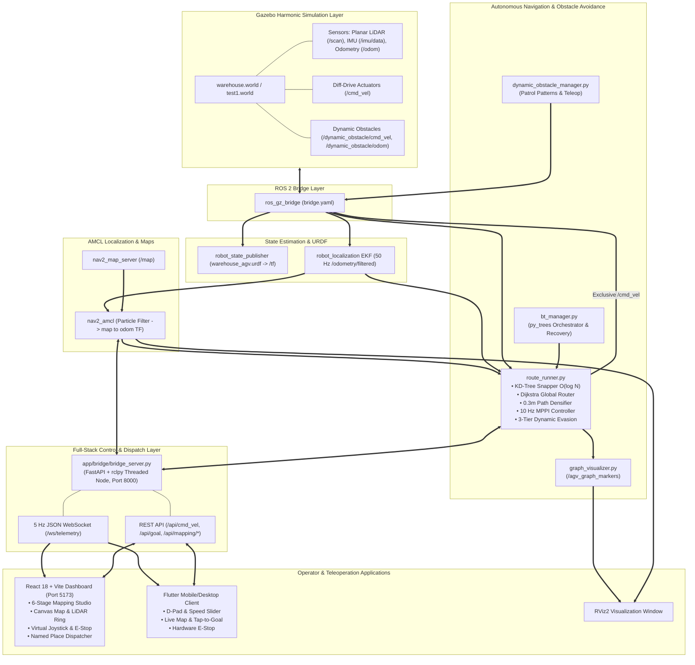
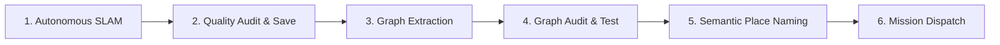

# Autonomous Mobile Robot (AMR) — Industrial Warehouse Navigation Stack

[](https://releases.ubuntu.com/24.04/)
[](https://docs.ros.org/en/jazzy/)
[](https://gazebosim.org/docs/harmonic/)
[](https://www.python.org/)
[](https://vitejs.dev/)
[](https://fastapi.tiangolo.com/)
[](https://flutter.dev/)

An end-to-end, production-grade **Autonomous Mobile Robot (AMR)** system engineered for structured warehouse logistics. The stack incorporates **autonomous frontier SLAM exploration**, **distance-transform topological roadmap extraction**, **KD-Tree accelerated Dijkstra global routing**, **Model Predictive Path Integral (MPPI) local trajectory control**, **3-tier predictive dynamic obstacle avoidance**, **Behavior Tree mission orchestration**, and a full-stack **FastAPI bridge** pairing with a **React 18 web dashboard** and **Flutter cross-platform mobile application**.

---

## 📑 Table of Contents

1. [System Overview & Architecture](#-system-overview--architecture)
2. [Robot Specifications & Kinematics](#-robot-specifications--kinematics)
3. [Repository Structure](#-repository-structure)
4. [The 6-Stage Operational Pipeline](#-the-6-stage-operational-pipeline)
   - [Stage 1: Autonomous SLAM Mapping](#stage-1-autonomous-slam-mapping)
   - [Stage 2: Map Verification & Saving](#stage-2-map-verification--saving)
   - [Stage 3: Topological Graph Extraction](#stage-3-topological-graph-extraction)
   - [Stage 4: Graph Verification & Route Simulation](#stage-4-graph-verification--route-simulation)
   - [Stage 5: Semantic Place Annotation](#stage-5-semantic-place-annotation)
   - [Stage 6: Production Navigation & Dispatch](#stage-6-production-navigation--dispatch)
5. [Navigation & Dynamic Obstacle Avoidance Engine](#-navigation--dynamic-obstacle-avoidance-engine)
   - [Global Dijkstra Planner & KD-Tree Snapper](#global-dijkstra-planner--kd-tree-snapper)
   - [Vectorized MPPI Local Controller](#vectorized-mppi-local-controller)
   - [3-Tier Dynamic Obstacle Avoidance](#3-tier-dynamic-obstacle-avoidance)
   - [Behavior Tree Mission Orchestrator](#behavior-tree-mission-orchestrator)
   - [Dynamic Obstacle Testing Suite](#dynamic-obstacle-testing-suite)
6. [Operator Interfaces: Web Dashboard & Mobile App](#-operator-interfaces-web-dashboard--mobile-app)
   - [React 18 Web Dashboard](#react-18-web-dashboard)
   - [FastAPI + rclpy Control Bridge](#fastapi--rclpy-control-bridge)
   - [Flutter Cross-Platform Mobile Client](#flutter-cross-platform-mobile-client)
7. [Prerequisites & Installation](#-prerequisites--installation)
8. [Step-by-Step Running Workflows](#-step-by-step-running-workflows)
   - [Workflow A: Production Navigation with Web Dashboard (Recommended)](#workflow-a-production-navigation-with-web-dashboard-recommended)
   - [Workflow B: Autonomous SLAM Mapping Session](#workflow-b-autonomous-slam-mapping-session)
   - [Workflow C: CLI & RViz2 Headless/Workstation Run](#workflow-c-cli--rviz2-headlessworkstation-run)
   - [Workflow D: Dynamic Obstacle Injection & Stress Testing](#workflow-d-dynamic-obstacle-injection--stress-testing)
   - [Workflow E: Flutter Mobile Setup](#workflow-e-flutter-mobile-setup)
9. [ROS 2 Interface & API Catalog](#-ros-2-interface--api-catalog)
10. [Configuration & Parameter Tuning](#-configuration--parameter-tuning)
11. [Benchmarking & Empirical Results](#-benchmarking--empirical-results)
12. [Troubleshooting & FAQ](#-troubleshooting--faq)
13. [License & Acknowledgments](#-license--acknowledgments)

---

## 🏗️ System Overview & Architecture

The architecture decouples global graph topology from high-frequency predictive control and provides high-speed, thread-safe bridges to operator applications.



### Architectural Highlights
- **Single Velocity Command Authority:** Unlike standard Nav2 configurations where the DWB controller conflicts with external planners, this stack reserves exclusive ownership of `/cmd_vel` for `route_runner`'s custom MPPI controller, eliminating command interleaving and heading oscillation.
- **Topological Graph Routing:** Instead of recalculating costmaps across millions of grid cells, global paths are solved in sub-millisecond Dijkstra runs on a collision-verified topological roadmap.
- **Multi-Client Bridge:** An asynchronous FastAPI server hosts an internal `rclpy` executor thread, allowing seamless real-time WebSocket telemetry push and REST dispatch without degrading ROS 2 real-time loops.

---

## 🤖 Robot Specifications & Kinematics

| Parameter | Value | Details |
| :--- | :--- | :--- |
| **Chassis Geometry** | Cylindrical base | Radius: `0.11 m`, Height: `0.10 m` (Diameter: `0.22 m`) |
| **Gross Vehicle Mass** | ~`10.4 kg` | Base: `8.0 kg`, Wheels: `2 × 0.8 kg`, Casters: `2 × 0.4 kg` |
| **Drive Architecture** | Differential Drive | 2 Actuated Wheels + 2 Passive Low-Friction Casters |
| **Drive Wheel Radius** | `0.025 m` | Diameter: `0.05 m`, Thickness: `0.02 m` |
| **Wheel Track (Separation)** | `0.26 m` | Symmetric lateral baseline |
| **LiDAR Sensor** | 2D Planar Laser | 360° FOV, 640 samples, Range: `0.12 m` – `12.0 m`, 10 Hz (`/scan`) |
| **IMU Sensor** | 6-DOF Inertial Unit | 3-axis gyro + 3-axis accelerometer at 50 Hz (`/imu/data`) |
| **Camera Sensor** | Forward RGB Camera | $640 \times 480$ resolution @ 30 FPS (`/camera/image_raw`) |
| **Kinematic Limits** | $v_{\text{max}} = 0.8\text{ m/s}$ | $\omega_{\text{max}} = 1.8\text{ rad/s}$ ($a_{\text{max}} = 1.5\text{ m/s}^2$) |
| **Mapping Velocity Cap** | $v_{\text{map}} = 0.4\text{ m/s}$ | Low-speed mode to prevent scan smear in narrow aisles |

---

## 📦 Repository Structure

```
AMR-main/
├── README.md                                 # Primary system manual and architecture reference
├── docs/                                     # In-depth architectural & benchmark documentation
│   ├── Comparative_Study.md                  # SOTA literature comparison and validation
│   ├── Dynamic_Obstacle_Avoidance_Improvements.md # Detailed 3-tier dynamic avoidance mechanics
│   ├── Dynamic_Obstacle_Guide.md             # Guide for adding & simulating moving obstacles
│   ├── Evaluation_Results.md                 # Empirical hardware/sim performance logs
│   ├── Metric_Comparison_Report.md           # Formal metric evaluation against academic benchmarks
│   ├── Phase1_Mapping.md                     # SLAM Toolbox & explore_lite guide
│   ├── Phase2_Node_Extraction.md             # Graph extractor mathematical derivation
│   ├── Phase3_Navigation.md                  # MPPI + Dijkstra navigation engineering report
│   ├── Running_Guide.md                      # Operational startup and mission guide
│   └── implementation.md                     # Deep technical implementation notes
├── app/                                      # Full-stack operator UI & bridge ecosystem
│   ├── bridge/
│   │   ├── bridge_server.py                  # Dual-threaded FastAPI + rclpy ROS 2 bridge (Port 8000)
│   │   ├── requirements.txt                  # Python dependencies (FastAPI, uvicorn, websockets, OpenCV)
│   │   └── run_bridge.sh                     # Automated environment-sourcing startup script
│   ├── web_dashboard/                        # React 18 + Vite Web Application
│   │   ├── package.json                      # Frontend dependencies (React, Vite, Nipple.js)
│   │   ├── run_dashboard.sh                  # Dashboard launch wrapper (Port 5173)
│   │   ├── src/
│   │   │   ├── App.jsx                       # Main application shell with view switcher & map sync
│   │   │   ├── index.css                     # Industrial dark-theme CSS design system
│   │   │   ├── components/
│   │   │   │   ├── MappingScreen.jsx         # 6-Stage end-to-end mapping, graph & naming studio
│   │   │   │   ├── MapView.jsx               # Interactive Canvas floorplan, path & graph visualizer
│   │   │   │   ├── ControlPanel.jsx          # Virtual joystick, speed controls, E-Stop & mission runner
│   │   │   │   ├── StatusBar.jsx             # Network connection, active map & battery telemetry
│   │   │   │   ├── TelemetryPanel.jsx        # Position, velocity, IMU yaw/pitch/roll & obstacle alert
│   │   │   │   ├── ScanRing.jsx              # 360° LiDAR proximity radar
│   │   │   │   └── EventLog.jsx              # Mission event timeline
│   │   │   └── services/
│   │   │       └── amrBridge.js              # WebSocket and REST client service
│   └── flutter_app/                          # Cross-platform mobile/desktop control client
│       ├── pubspec.yaml                      # Flutter dependencies
│       └── lib/                              # Dart screens (Map, Control, Monitor, Connect)
└── src/                                      # ROS 2 Jazzy workspace source packages
    ├── agv_description/                      # Simulation model, maps, configs, and launch pipelines
    │   ├── CMakeLists.txt & package.xml      # Ament package metadata
    │   ├── config/
    │   │   ├── bridge.yaml                   # Gazebo Harmonic <-> ROS 2 topic bridging schema
    │   │   ├── ekf.yaml                      # robot_localization sensor fusion configuration
    │   │   ├── mapper_params.yaml            # SLAM Toolbox online async configuration
    │   │   ├── nav2_params.yaml              # AMCL & Map Server production configuration
    │   │   ├── nav2_params_explore.yaml      # Costmap & controller configuration for exploration
    │   │   ├── agv_nav.rviz                  # RViz2 layout for production navigation
    │   │   └── agv_explore.rviz              # RViz2 layout for SLAM mapping sessions
    │   ├── launch/
    │   │   ├── navigation_launch.py          # Production launch (Gazebo + RSP + EKF + AMCL + RViz)
    │   │   ├── mapping_session.launch.py     # Timed Phase 1 autonomous SLAM mapping launch
    │   │   ├── gazebo.launch.py              # Base simulation stack without localization
    │   │   └── dynamic_obstacle.launch.py    # Spawner for animated warehouse dynamic obstacles
    │   ├── maps/                             # Pre-compiled maps, topological graphs, and places
    │   │   ├── graph_extractor.py            # Offline Distance-Transform graph generator
    │   │   ├── warehouse_map.pgm & .yaml     # Standard warehouse occupancy grid map
    │   │   ├── warehouse_map_graph.json      # Topological roadmap for standard warehouse (756 nodes)
    │   │   ├── warehouse_map_places.json     # Semantic locations for standard warehouse
    │   │   ├── warehouse_01.pgm & .yaml      # Second warehouse occupancy grid map
    │   │   ├── warehouse_01_graph.json       # Topological roadmap for warehouse 01
    │   │   ├── warehouse_01_places.json      # Semantic locations for warehouse 01
    │   │   └── clean_warehouse_map.png       # High-contrast floorplan for web dashboard rendering
    │   ├── models/                           # Gazebo SDF models (dynamic obstacles, pallets)
    │   ├── scripts/
    │   │   └── save_map.sh                   # Helper script to trigger nav2_map_saver
    │   ├── urdf/
    │   │   └── warehouse_agv.urdf            # Complete robot description (masses, inertias, joints)
    │   └── worlds/
    │       ├── warehouse.world               # Primary industrial warehouse world (racks, aisles, pillars)
    │       └── test1.world                   # Secondary testing environment for dynamic evasion
    ├── agv_navigation/                       # Core routing, control, and behavior orchestration
    │   ├── setup.py & package.xml            # Python package build configuration
    │   └── agv_navigation/
    │       ├── route_runner.py               # Core node: Dijkstra + KD-Tree + MPPI + Dynamic Evasion
    │       ├── graph_visualizer.py           # RViz2 marker publisher for nodes, edges, and dense paths
    │       ├── bt_manager.py                 # py_trees Behavior Tree mission manager
    │       ├── dynamic_obstacle_manager.py   # Pattern runner for animated obstacles
    │       └── obstacle_teleop.py            # Keyboard teleoperation for dynamic obstacles
    ├── agv_vision/                           # Vision processing nodes
    │   └── agv_vision/
    │       └── obstacle_detector.py          # OpenCV HSV threshold detector for colored obstacles
    └── m-explore-ros2/                       # explore_lite package for frontier-based exploration
```

---

## 🔄 The 6-Stage Operational Pipeline

The system incorporates a structured 6-stage lifecycle designed for industrial facility deployment, accessible either via the **Web Dashboard Mapping Studio** (`MappingScreen.jsx`) or via the command line.



### Stage 1: Autonomous SLAM Mapping
- **Engines:** `slam_toolbox` (online asynchronous mode) paired with `explore_lite` frontier exploration.
- **Workflow:** The robot autonomously identifies frontiers between explored free space and uncharted territory, plans exploration trajectories, and builds a $0.05\text{ m/pixel}$ occupancy grid in real time.
- **Alternative:** Manual operator teleoperation at a safety-capped speed of $0.4\text{ m/s}$ using the dashboard virtual joystick.

### Stage 2: Map Verification & Saving
- **Audit Metrics:** Analyzes reachable area percentage, border containment, occupancy distribution, and scan consistency.
- **Persistence:** Exports the map to disk as `.pgm` (binary occupancy), `.yaml` (metadata & origin offsets), and high-resolution architectural `.png` for UI rendering.

### Stage 3: Topological Graph Extraction
- **Algorithm:** The occupancy grid is processed through an $L_2$ Euclidean Distance Transform (`cv2.distanceTransform`).
- **Clearance Checking:** Pixels with clearance $< (r_{\text{robot}} + \text{margin}) = 0.11\text{ m} + 0.10\text{ m} = 0.21\text{ m}$ are culled.
- **Adaptive Multi-Resolution Sampling:** Candidate nodes are seeded across three density tiers:
  - Narrow corridors: `0.40 m` spacing (dense for precise clearance)
  - Medium aisles: `0.50 m` spacing
  - Open spaces: `0.80 m` spacing
- **Line-of-Sight Connection:** Candidate node pairs within search radius ($2.5\text{ m}$) are evaluated using Bresenham's line algorithm; edges are added only if every intermediate pixel preserves minimum safety clearance.

### Stage 4: Graph Verification & Route Simulation
- **Structural Audit:** Guarantees all edges are bidirectional ($u \leftrightarrow v$), verifies connected components, and flags isolated dead ends.
- **Interactive Routing Test:** Built-in Dijkstra router simulates point-to-point paths between arbitrary node IDs ($N_i \to N_j$), overlaying the computed route on the map to confirm navigability before commissioning.

### Stage 5: Semantic Place Annotation
- **Place Classes:** Assigns semantic labels to graph nodes:
  - ⚡ `CHARGING_DOCK`
  - 📦 `PICKUP_STATION` & `DROPOFF_STATION`
  - 🗄️ `STORAGE_RACK` & `AISLE_WAYPOINT`
  - 🔍 `INSPECTION_POINT`
- **Output:** Stored in `<map_name>_places.json` with human-readable coordinates, orientations, and descriptions.

### Stage 6: Production Navigation & Dispatch
- The commission is complete. The robot accepts single-point goals, multi-point sequence missions, or high-level named location dispatches from the web UI, mobile app, or ROS 2 action topics.

---

## 🧭 Navigation & Dynamic Obstacle Avoidance Engine

### Global Dijkstra Planner & KD-Tree Snapper
1. **$O(\log N)$ Spatial Indexing:** Graph nodes are indexed into a `scipy.spatial.KDTree`. When an arbitrary continuous goal $(x, y)$ or current robot pose is received, the nearest collision-free graph node is snapped in microseconds.
2. **Deterministic Routing:** Dijkstra's shortest-path algorithm evaluates edge Euclidean distances $d(u, v)$ plus any dynamic blockage penalties.
3. **Dense Waypoint Densification:** Coarse topological segments are interpolated into dense $0.3\text{ m}$ waypoints with continuous tangent headings $\theta = \text{atan2}(\Delta y, \Delta x)$.

### Vectorized MPPI Local Controller
The local planner executes at **10 Hz** in Python with NumPy vectorization, generating 80 stochastic trajectories over a 15-step horizon ($1.5\text{ s}$ preview).

#### Control Law & Cost Objective
Each simulated sample trajectory $k \in [1, K]$ is evaluated against a multi-term objective:
$$J_k = w_{\text{dist}} \cdot d_{\text{term}} + w_{\text{heading}} \cdot |\Delta \theta_{\text{lookahead}}| + w_{\text{cte}} \cdot d_{\text{cross-track}}^2 + \sum_{t=1}^{T} \left( C_{\text{static}}(t) + C_{\text{dynamic}}(t) \right)$$

| Parameter | Nominal Value | Description |
| :--- | :--- | :--- |
| `num_samples` | 80 | Number of stochastic velocity rollouts per control cycle |
| `horizon` | 15 steps | Prediction steps ($1.5\text{ s}$ horizon at $\Delta t = 0.1\text{ s}$) |
| `v_max` / `w_max` | `0.8 m/s` / `1.8 rad/s` | Maximum allowable linear and angular speeds |
| `lookahead_dist` | `1.2 m` | Arc-length lookahead along the densified waypoint path |
| `w_dist` | 4.0 | Terminal distance cost weight |
| `w_heading` | 3.0 | Heading error penalty relative to path tangent |
| `w_cross_track` | 6.0 (Nominal) | Cross-track error penalty (softens to 2.5 during active evasion) |
| `w_collision` | 5000.0 | Static obstacle collision penalty (within `0.30 m`) |
| `dynamic_repulsive_dist` | 0.85 m | Proactive evasion bubble for moving obstacles |
| `dynamic_w_repulsive` | 45.0 | Potential field repulsive gradient |

Optimal controls are synthesized via softmax weight averaging:
$$\omega_k = \frac{\exp(-\frac{1}{\lambda} (J_k - \min J))}{\sum_j \exp(-\frac{1}{\lambda} (J_j - \min J))}, \quad \mathbf{u}^* = \sum_{k=1}^K \omega_k \mathbf{u}_k$$

### 3-Tier Dynamic Obstacle Avoidance

```
                     ┌────────────────────────────────┐
                     │ Dynamic Obstacle in Perception  │
                     └───────────────┬────────────────┘
                                     │
                 ┌───────────────────┴───────────────────┐
                 ▼                                       ▼
       [Wide Corridor / Space]                  [Narrow Warehouse Aisle]
                 │                                       │
      Tier 1: Predictive MPPI                     Is evasion possible
      • Rollout future positions                  without rack collision?
        p(t) = p0 + v*t                                  │
      • 0.85m repulsive field                            ├──────────────┐
      • Soften CTE 6.0 -> 2.5                            ▼ (No)         ▼ (Yes)
                 │                               Tier 2: Yield & Wait  Tier 1 Swerve
                 │                               • Decelerate to 0 m/s
                 │                               • Hold heading
                 │                               • Wait for crossing
                 │                                       │
                 │                                Does obstacle clear
                 │                                within 2.5 seconds?
                 │                                       │
                 │                               ┌───────┴───────┐
                 │                               ▼ (Yes)         ▼ (No: Blocked)
                 │                        Resume Transit  Tier 3: Dynamic Re-Route
                 │                                        • Penalize blocked edge
                 │                                        • Re-run Dijkstra
                 ▼                                        • Navigate alternate aisle
         Goal Reached Safely ◄───────────────────────────────────┘
```

1. **Tier 1 — Predictive MPPI Rollout (Active Evasion):**
   - LiDAR scans are clustered to detect moving objects and estimate their 2D velocity $(v_x, v_y)$.
   - Dynamic obstacle positions are projected forward across the 15-step horizon.
   - A graduated repulsive potential field pushes the rollouts away from the projected obstacle path.
   - The path cross-track weight dynamically relaxes ($6.0 \to 2.5$), allowing the AMR to deviate from the centerline to pass.
2. **Tier 2 — Yield & Wait (Constrained Aisles):**
   - In narrow aisles ($1.2\text{ m} - 1.5\text{ m}$), swerving would cause collisions with shelving.
   - If forward clearance drops below $0.5\text{ m}$ and all MPPI samples are blocked, the AMR enters `YIELDING` mode ($v = 0\text{ m/s}$), holding position while the human worker or cart crosses.
3. **Tier 3 — Dynamic Dijkstra Re-Routing (Persistent Blockages):**
   - If an obstacle parks or remains stationary in the aisle for $> 2.5\text{ seconds}$, the local controller signals the global planner.
   - The blocked topological edge is assigned an extreme penalty weight ($+10,000$).
   - Dijkstra computes an immediate alternate route around adjacent warehouse aisles, executing an autonomous detour.

### Behavior Tree Mission Orchestrator
The `bt_manager.py` node integrates with `py_trees` to orchestrate multi-stage missions and autonomous fault recovery:
- **Condition Guards:** `CheckLocalization` (validates `map -> base_link` TF transforms before allowing motion) and `CheckGoalQueue` (monitors pending goals).
- **Execution Actions:** `PlanTopologicalPath` and `ExecuteMPPINavigation`.
- **Fault Recovery:**
  - `BackUpRecovery`: Reverses the robot by $0.3\text{ m}$ if wedged in a dead-end or unexpected clutter.
  - `SpinRecovery`: Rotates the robot by 60° to clear LiDAR occlusions and rebuild local cost estimation.

### Dynamic Obstacle Testing Suite
The repository includes automated simulation agents to stress-test navigation in Gazebo Harmonic:
- **`dynamic_obstacle_manager.py`** supports 4 autonomous patrol patterns:
  1. `aisle_crossing`: Walks back and forth across warehouse aisles.
  2. `corridor_walker`: Paces along narrow corridors (head-on traffic).
  3. `doorway_blocker`: Parks inside central doorways to trigger Tier-3 re-routing.
  4. `circular_patrol`: Moves in continuous loops around warehouse pillars.
- **`obstacle_teleop.py`**: Interactive keyboard controller allowing human operators to drive dynamic obstacles manually via WASD.

---

## 💻 Operator Interfaces: Web Dashboard & Mobile App

### React 18 Web Dashboard
Located in [`app/web_dashboard/`](file:///home/rahul/AMR/AMR-main/app/web_dashboard/), the web client is built with **React 18**, **Vite**, and **Nipple.js**.

- **Interactive Canvas Map:** Smooth pan/zoom visualization of the warehouse floorplan, showing live robot pose, orientation arrow, dense path waypoints, topological graph nodes/edges, and semantic places.
- **6-Stage Mapping Studio:** Full UI to run autonomous exploration, monitor live SLAM occupancy, run quality audits, save maps, extract roadmaps, test Dijkstra paths, and annotate named places.
- **Dual Teleoperation:** Touch/mouse-enabled virtual joystick with fine-grained linear/angular scaling and safety dead-man timeout.
- **Radar & Telemetry HUD:** 360° LiDAR proximity ring, velocity dials, IMU roll/pitch/yaw meters, and real-time state machine badge (`IDLE`, `PLANNING`, `NAVIGATING`, `YIELDING`, `RE_ROUTING`).
- **One-Touch Emergency Stop:** Immediate software E-Stop publishing `/agv_estop`.

### FastAPI + rclpy Control Bridge
Located in [`app/bridge/bridge_server.py`](file:///home/rahul/AMR/AMR-main/app/bridge/bridge_server.py), this service bridges browser clients and ROS 2:
- Runs an asynchronous **Uvicorn/FastAPI** server on port `8000`.
- Spins a dedicated background thread with a ROS 2 `SingleThreadedExecutor`.
- Broadcasts 5 Hz WebSocket telemetry snapshots containing filtered pose, velocities, laser scans, mission progress, and navigation states.
- Implements background process management to launch, monitor, and terminate SLAM exploration sessions dynamically via REST calls.

### Flutter Cross-Platform Mobile Client
Located in [`app/flutter_app/`](file:///home/rahul/AMR/AMR-main/app/flutter_app/), providing a dedicated tablet/phone interface for floor supervisors:
- Multi-platform: Android, Linux desktop, and Web.
- Live floorplan sync with tap-to-navigate goal dispatching.
- Continuous 10 Hz D-pad teleoperation and hardware-style E-Stop.

---

## 🛠️ Prerequisites & Installation

### System Requirements
- **Host OS:** Ubuntu 24.04 LTS (Noble Numbat)
- **ROS 2 Distribution:** [ROS 2 Jazzy Jalisco](https://docs.ros.org/en/jazzy/Installation.html)
- **Simulation Engine:** Gazebo Harmonic (`ros-jazzy-ros-gz`)
- **Python Version:** Python 3.12+
- **Node.js & npm:** Node.js v20.x or higher

### 1. Install System & ROS 2 Dependencies

```bash
sudo apt update && sudo apt install -y \
  ros-jazzy-desktop \
  ros-jazzy-ros-gz \
  ros-jazzy-navigation2 \
  ros-jazzy-nav2-bringup \
  ros-jazzy-slam-toolbox \
  ros-jazzy-robot-localization \
  ros-jazzy-teleop-twist-keyboard \
  python3-colcon-common-extensions \
  python3-pip \
  python3-opencv \
  python3-yaml \
  python3-scipy
```

Install Python libraries for behavior trees and web services:

```bash
pip install --break-system-packages \
  py_trees \
  fastapi \
  uvicorn \
  websockets \
  pydantic \
  Pillow
```

### 2. Clone the Repository & Build Workspace

```bash
cd ~
git clone https://github.com/RahulK27-pro/AMR.git
cd AMR/AMR-main

# Build workspace packages
colcon build --symlink-install

# Source workspace setup
source install/setup.bash
```

> [!IMPORTANT]
> Always run `source install/setup.bash` in **every** new terminal before launching ROS 2 commands.

### 3. Install Web Dashboard Dependencies

```bash
cd ~/AMR/AMR-main/app/web_dashboard
npm install
```

---

## 🚀 Step-by-Step Running Workflows

### Workflow A: Production Navigation with Web Dashboard (Recommended)

This workflow starts the Gazebo simulation, AMCL localization, the MPPI route runner, the bridge server, and the web dashboard.

#### Terminal 1 — Gazebo Simulation & AMCL Localization
```bash
cd ~/AMR/AMR-main
source install/setup.bash
ros2 launch agv_description navigation_launch.py
```
*Wait until you see `Managed nodes are active` in the terminal.*

#### Terminal 2 — MPPI Route Runner
```bash
cd ~/AMR/AMR-main
source install/setup.bash
ros2 run agv_navigation route_runner
```
*Wait for: `Localization Active! Received map -> base_link TF transform.`*

#### Terminal 3 — Control Bridge Server
```bash
cd ~/AMR/AMR-main/app/bridge
./run_bridge.sh
```
*Bridge launches on `http://0.0.0.0:8000`.*

#### Terminal 4 — Web Dashboard
```bash
cd ~/AMR/AMR-main/app/web_dashboard
npm run dev
```
*Open **`http://localhost:5173`** in your browser.*

#### Operating from the Web Dashboard:
1. Verify the green **CONNECTED** indicator in the top status bar.
2. Select your map (e.g. `warehouse_map` or `warehouse_01`).
3. Click anywhere on the map to dispatch a 2D navigation goal, or click **Run Mission** on a sequence of named places.
4. Use the virtual joystick to manually drive the AMR at any time.

---

### Workflow B: Autonomous SLAM Mapping Session

Use this workflow to map a new warehouse environment from scratch.

#### Terminal 1 — Autonomous Mapping Session Launch
```bash
cd ~/AMR/AMR-main
source install/setup.bash
ros2 launch agv_description mapping_session.launch.py
```

The timed launch sequence proceeds automatically:
- `t = 0s`: Gazebo Harmonic + Bridge + EKF node
- `t = 3s`: Robot State Publisher
- `t = 12s`: SLAM Toolbox (online asynchronous)
- `t = 13s`: RViz2 configured with exploration layout
- `t = 20s`: Nav2 costmaps and planner
- `t = 45s`: `explore_lite` frontier exploration begins autonomous mapping

#### Terminal 2 — Save Map & Generate Graph
Once the warehouse exploration is complete:
```bash
# Save the SLAM occupancy grid
bash ~/AMR/AMR-main/src/agv_description/scripts/save_map.sh

# Extract the topological roadmap
cd ~/AMR/AMR-main/src/agv_description/maps
python3 graph_extractor.py warehouse_map.yaml
```

---

### Workflow C: CLI & RViz2 Headless/Workstation Run

For development without web services:

1. **Terminal 1 (Simulation + AMCL):**
   ```bash
   ros2 launch agv_description navigation_launch.py
   ```
2. **Terminal 2 (Set Initial Pose):**
   In the auto-opened RViz2 window, click **"2D Pose Estimate"** and set the robot's approximate position on the map.
3. **Terminal 3 (Graph Visualizer):**
   ```bash
   ros2 run agv_navigation graph_visualizer
   ```
   Add a `MarkerArray` display for topic `/agv_graph_markers` to see nodes (yellow) and edges (cyan).
4. **Terminal 4 (Route Runner):**
   ```bash
   ros2 run agv_navigation route_runner
   ```
5. **Terminal 5 (Optional - Behavior Tree Manager):**
   ```bash
   ros2 run agv_navigation bt_manager
   ```
6. **Send a Goal via RViz2:**
   Click **"2D Goal Pose"** on any open hallway. The robot will snap to the nearest node and navigate.

---

### Workflow D: Dynamic Obstacle Injection & Stress Testing

To test the robot's predictive MPPI swerving, yielding, and re-routing:

#### Terminal 1 — Spawn Dynamic Obstacle
```bash
cd ~/AMR/AMR-main
source install/setup.bash

# Spawn an aisle-crossing moving obstacle
ros2 launch agv_description dynamic_obstacle.launch.py \
    pattern:=aisle_crossing speed:=0.35 x:=1.8 y:=0.0
```

#### Other Available Obstacle Modes:
```bash
# Test doorway blockage to trigger Tier-3 Dijkstra re-routing:
ros2 launch agv_description dynamic_obstacle.launch.py \
    pattern:=doorway_blocker x:=3.0 y:=2.8

# Spawn obstacle for interactive keyboard driving:
ros2 launch agv_description dynamic_obstacle.launch.py \
    run_controller:=false x:=1.5 y:=0.0

# Drive the obstacle in another terminal:
ros2 run agv_navigation obstacle_teleop
```

---

### Workflow E: Flutter Mobile Setup

```bash
cd ~/AMR/AMR-main/app/flutter_app

# Install flutter dependencies
flutter pub get

# Identify host IP on the LAN
hostname -I   # e.g., 192.168.1.50

# Run on connected Android device or desktop Linux
flutter run -d linux
# Or: flutter run -d <android-device-id>
```
*In the mobile app connect screen, enter: `http://192.168.1.50:8000`.*

---

## 📡 ROS 2 Interface & API Catalog

### Key ROS 2 Topics

| Topic | Message Type | Rate | Flow Direction | Description |
| :--- | :--- | :--- | :--- | :--- |
| `/scan` | `sensor_msgs/LaserScan` | 10 Hz | Gazebo → ROS | Planar LiDAR range array |
| `/odom` | `nav_msgs/Odometry` | 30 Hz | Gazebo → ROS | Raw wheel odometry |
| `/imu/data` | `sensor_msgs/Imu` | 50 Hz | Gazebo → ROS | 6-DOF IMU angular rates & linear accels |
| `/odometry/filtered` | `nav_msgs/Odometry` | 50 Hz | EKF → Route Runner | Fused state estimation |
| `/cmd_vel` | `geometry_msgs/Twist` | 10 Hz | Route Runner → Gazebo | Exclusive linear and angular velocity commands |
| `/goal_pose` | `geometry_msgs/PoseStamped` | Event | RViz / Bridge → Route Runner | Target navigation destination |
| `/goal_sequence` | `std_msgs/String` | Event | Bridge / BT → Route Runner | JSON array of node IDs for multi-stop missions |
| `/agv_dense_path` | `nav_msgs/Path` | 10 Hz | Route Runner → Visualizer | Interpolated $0.3\text{ m}$ waypoints |
| `/agv_graph_markers` | `visualization_msgs/MarkerArray` | 2 Hz | Visualizer → RViz2 | Topological graph nodes, labels, and edges |
| `/agv_state` | `std_msgs/String` | 10 Hz | Route Runner → Bridge | Navigation state machine status |
| `/agv_estop` | `std_msgs/Bool` | Event | Bridge / UI → Route Runner | Emergency stop override |
| `/dynamic_obstacle/cmd_vel` | `geometry_msgs/Twist` | 10 Hz | Manager / Teleop → Gazebo | Animated obstacle velocity commands |
| `/dynamic_obstacle/odom` | `nav_msgs/Odometry` | 30 Hz | Gazebo → Manager | Animated obstacle ground truth |

---

### FastAPI Bridge REST & WebSocket API

| Endpoint | Method | Payload / Format | Description |
| :--- | :--- | :--- | :--- |
| `/api/status` | `GET` | JSON | Instantaneous telemetry snapshot (pose, vel, battery, state) |
| `/api/map` | `GET` | Base64 JPEG | Static map with live robot pose & path overlay |
| `/api/map/raw` | `GET` | Image File | Raw map image file |
| `/api/map/clean` | `GET` | Image File | Clean architectural floorplan (uncluttered) |
| `/api/map/active` | `GET` / `POST` | `{"map_name": "..."}` | Get or switch the active navigation roadmap |
| `/api/graph` | `GET` | JSON | Returns active graph nodes and bidirectional edges |
| `/api/cmd_vel` | `POST` | `{"linear": 0.4, "angular": 0.0}` | Operator teleoperation command |
| `/api/goal` | `POST` | `{"x": 2.5, "y": 1.2}` | Dispatches target coordinate goal |
| `/api/initial_pose` | `POST` | `{"x": 0.0, "y": 0.0, "theta": 0.0}` | Seeds AMCL initial localization pose |
| `/api/stop` | `POST` | None | Halts robot and asserts software E-Stop |
| `/api/estop/clear` | `POST` | None | Releases E-Stop state |
| `/api/goal_sequence` | `POST` | `{"nodes": ["N12", "N45", "N8"]}` | Dispatches multi-goal mission sequence |
| `/api/mapping/start` | `POST` | `{"map_name": "...", "world": "..."}` | Launches autonomous SLAM background session |
| `/api/mapping/stop` | `POST` | None | Terminates active SLAM exploration session |
| `/api/mapping/save` | `POST` | `{"map_name": "..."}` | Triggers map audit and on-disk saving |
| `/api/mapping/graph/extract`| `POST` | `{"map_name": "...", "preset": "..."}` | Runs distance-transform roadmap extraction |
| `/api/mapping/places` | `GET` / `POST` | JSON Array of Places | Fetch or update semantic annotated locations |
| `/ws/telemetry` | `WebSocket`| JSON Stream (5 Hz) | High-speed real-time telemetry stream |

---

## ⚙️ Configuration & Parameter Tuning

### MPPI Controller Parameters ([`route_runner.py`](file:///home/rahul/AMR/AMR-main/src/agv_navigation/agv_navigation/route_runner.py))

```python
# Tuning constants in route_runner.py
self.v_max = 0.8                   # Maximum linear velocity (m/s)
self.w_max = 1.8                   # Maximum angular velocity (rad/s)
self.horizon = 15                  # Prediction steps (1.5 s ahead at dt=0.1s)
self.num_samples = 80              # Trajectory rollouts evaluated per cycle
self.lookahead_dist = 1.2          # Target tracking lookahead distance (m)

# Objective cost weights
self.w_dist = 4.0                  # Weight toward reaching the lookahead target
self.w_heading = 3.0               # Weight aligned with path tangent
self.w_cross_track = 6.0           # Nominal penalty for path centerline deviation
self.w_collision = 5000.0          # Hard obstacle avoidance penalty
self.dynamic_w_repulsive = 45.0    # Soft proactive moving obstacle repulsion
self.dynamic_repulsive_dist = 0.85 # Proactive evasion envelope around dynamic objects
```

### EKF Sensor Fusion ([`ekf.yaml`](file:///home/rahul/AMR/AMR-main/src/agv_description/config/ekf.yaml))
- Operates at **50 Hz** in the `odom` frame.
- `/odom` fuses velocity signals: $\dot{x}, \dot{y}, \dot{\theta}$ (preventing absolute encoder drift from accumulating).
- `/imu/data` fuses angular rate $\dot{\theta}$ and absolute orientation $\theta$.

---

## 📊 Benchmarking & Empirical Results

Extracted from comparative evaluations against state-of-the-art literature (see [`docs/Metric_Comparison_Report.md`](file:///home/rahul/AMR/AMR-main/docs/Metric_Comparison_Report.md)):

```
+----------------------------------------------------------------------------------------------------+
|                                     BENCHMARK PERFORMANCE SUMMARY                                  |
+------------------------------------+----------------------------------+----------------------------+
| 🚀 EXPLORATION COVERAGE RATE       | ⏱️ TIME PER COVERAGE POINT       | 🛣️ PATH PER COVERAGE POINT |
| 0.311 %/s (AMR) vs 0.185 %/s (Lit) | 3.21 s/% (AMR) vs 5.41 s/% (Lit) | 6.04 m/% vs 8.76 m/% (Lit) |
| Outcome: 1.68x Faster Exploration  | Outcome: 40.7% Less Time         | Outcome: 31.1% Less Driven |
+------------------------------------+----------------------------------+----------------------------+
| 🧭 GLOBAL PLANNING LATENCY         | 💾 MEMORY SCALING EFFICIENCY     | ⚡ LOCAL MPPI UPDATE RATE  |
| < 50 ms (0.084 ms/m over 592 m)    | 180 MB RSS (~20% Lower Footprint)| 10.0 Hz Real-Time Compute  |
| 756 Nodes (4.44 nodes/m²)          | KD-Tree O(log N) Acceleration    | 80 Rollouts x 15 Horizon   |
+------------------------------------+----------------------------------+----------------------------+
| 🎯 NOMINAL TRACKING RMSE           | 🛡️ DYNAMIC EVASION SWERVE        | 🛑 SIMULATED COLLISION RATE|
| 0.1055 m (Nominal Transit)         | 1.5971 m (Safe Wide Evasion)     | 0.0% Across All Test Runs  |
+------------------------------------+----------------------------------+----------------------------+
```

---

## 🔧 Troubleshooting & FAQ

### 1. AMCL warns: "Cannot publish a pose, no initial pose received"
- **Cause:** AMCL particle filter is unseeded.
- **Fix:** In RViz, use the **"2D Pose Estimate"** tool and click the robot's approximate position on the map. Alternatively, send an initial pose via REST:
  ```bash
  curl -X POST http://localhost:8000/api/initial_pose \
    -H "Content-Type: application/json" \
    -d '{"x": 0.0, "y": 0.0, "theta": 0.0}'
  ```

### 2. `route_runner` reports: "Waiting for localization/odometry..."
- **Cause:** The `map -> base_link` TF transform from AMCL is not yet available.
- **Fix:** Ensure `navigation_launch.py` is fully initialized and AMCL has confirmed `initialPoseReceived`.

### 3. Port 8000 already in use
- **Cause:** A previous instance of `bridge_server.py` is still bound to the port.
- **Fix:** Execute `lsof -ti:8000 | xargs kill -9` or launch using `./run_bridge.sh` (which auto-clears old instances).

### 4. Robot circles or oscillates near waypoints
- **Cause:** Conflicting velocity publishers or improper lookahead distance.
- **Fix:** Ensure Nav2 `controller_server` (DWB) is not running. In `route_runner.py`, verify `lookahead_dist` is set to `1.2 m` and `w_cross_track` is set to `6.0`.

### 5. Web Dashboard shows "DISCONNECTED"
- **Cause:** The bridge server is not running or blocked by a firewall.
- **Fix:** Start the bridge server with `cd app/bridge && ./run_bridge.sh`. If running on a remote machine, allow port 8000: `sudo ufw allow 8000`.

---

## 📜 License & Acknowledgments

This project is licensed under the [MIT License](LICENSE).

- **Simulation Engine:** [Gazebo Harmonic](https://gazebosim.org/)
- **Robotics Middleware:** [ROS 2 Jazzy Jalisco](https://docs.ros.org/en/jazzy/)
- **Localization:** [Nav2 AMCL](https://navigation.ros.org/)
- **Sensor Fusion:** [robot_localization](https://docs.ros.org/en/noetic/api/robot_localization/html/index.html)
- **Frontier Exploration:** [m-explore-ros2](https://github.com/robo-friends/m-explore-ros2)
- **Behavior Trees:** [py_trees](https://py-trees.readthedocs.io/)
